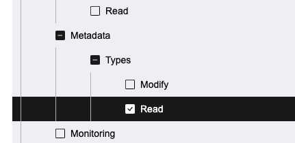
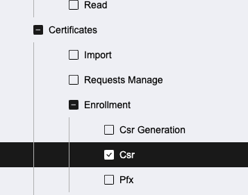
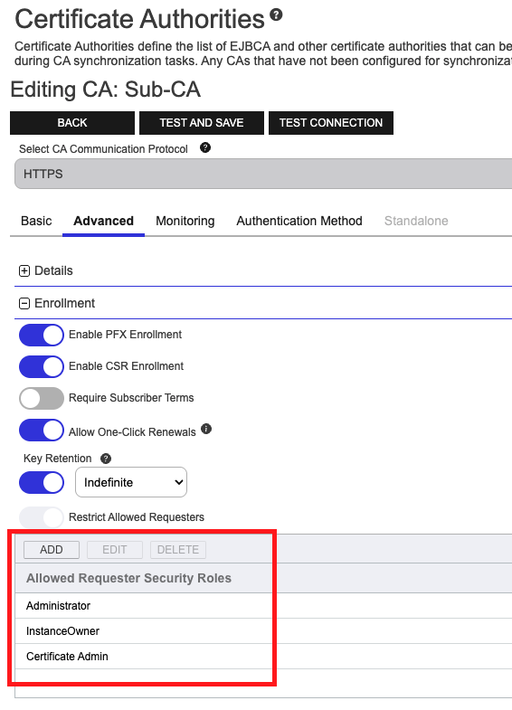
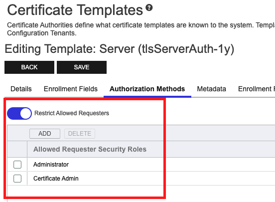
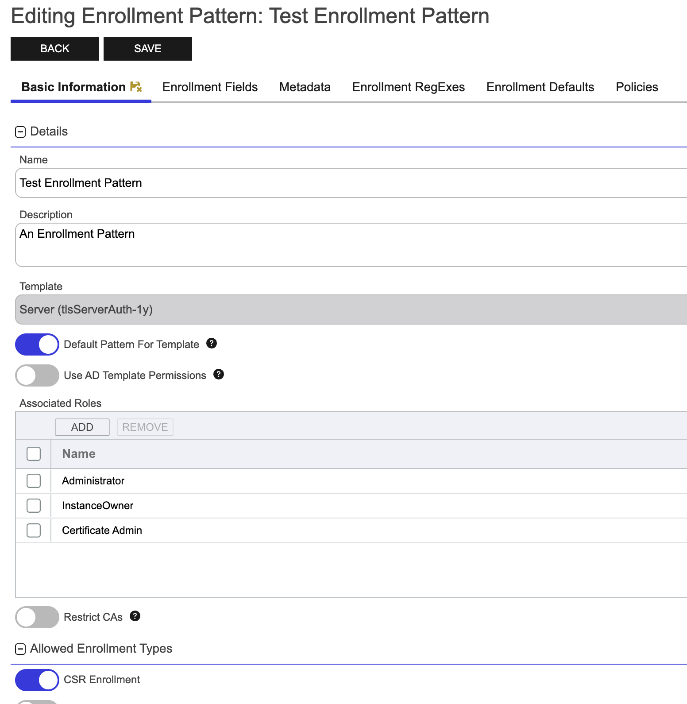

<h1 align="center" style="border-bottom: none">
    Command Issuer
</h1>

<p align="center">
  <!-- Badges -->

<a href="https://github.com/Keyfactor/command-cert-manager-issuer/releases"></a>


</p>

<p align="center">
  <!-- TOC -->
  <a href="#support">
    <b>Support</b>
  </a> 
  ·
  <a href="#license">
    <b>License</b>
  </a>
  ·
  <a href="https://github.com/topics/keyfactor-integration">
    <b>Related Integrations</b>
  </a>
</p>

## Support
The Command Issuer is open source and community supported, meaning that there is **no SLA** applicable. 

> To report a problem or suggest a new feature, use the **[Issues](../../issues)** tab. If you want to contribute actual bug fixes or proposed enhancements, use the **[Pull requests](../../pulls)** tab.


# Overview

The Command Issuer for [cert-manager](https://cert-manager.io/) is a [CertificateRequest](https://cert-manager.io/docs/usage/certificaterequest/) controller that issues certificates using [Keyfactor Command](https://www.keyfactor.com/products/command/).

# Requirements

Before continuing, ensure that the following requirements are met:

- [Keyfactor Command](https://www.keyfactor.com/products/command/) >= 10.5
    - Command must be properly configured according to the [product docs](https://software.keyfactor.com/Core-OnPrem/Current/Content/MasterTopics/Portal.htm). 
    - You have access to the Command REST API. The following endpoints must be available:
        - `/Status/Endpoints`
        - `/Enrollment/CSR`
        - `/MetadataFields`
        - `/EnrollmentPatterns` (Keyfactor Command 25.1 and above)
- Kubernetes >= v1.19
    - [Kubernetes](https://kubernetes.io/docs/tasks/tools/), [Minikube](https://minikube.sigs.k8s.io/docs/start/), [Kind](https://kind.sigs.k8s.io/docs/user/quick-start/), etc.
    > You must have permission to create [Custom Resource Definitions](https://kubernetes.io/docs/concepts/extend-kubernetes/api-extension/custom-resources/) in your Kubernetes cluster.
- [Supported cert-manager release](https://cert-manager.io/docs/releases/) installed in your cluster. Please see the [cert-manager installation](https://cert-manager.io/docs/installation/) for details.
- [Supported version of Helm](https://helm.sh/docs/topics/version_skew/) for your Kubernetes version

# Getting Started

## Configuring Command

Command Issuer enrolls certificates by submitting a POST request to the Command CSR Enrollment endpoint. Before using Command Issuer, you must create or identify a Certificate Authority _and_ Certificate Template / Enrollment Pattern suitable for your use case. Additionally, you should ensure that the [identity provider](https://software.keyfactor.com/Core-OnPrem/Current/Content/WebAPI/AuthenticateAPI.htm#AuthenticatingtotheKeyfactorAPI) used by the Issuer/ClusterIssuer has the appropriate permissions in Command.

1. **Create or identify a Certificate Authority**

    A certificate authority (CA) is an entity that issues digital certificates. Within Keyfactor Command, a CA may be a Microsoft CA, EJBCA, or a Keyfactor gateway to a cloud-based or remote CA.

    - If you haven't created a Certificate Authority before, refer to the [Command documentation](https://software.keyfactor.com/Core-OnPrem/Current/Content/ReferenceGuide/CA-Operations.htm) to learn how, or reach out to your Keyfactor support representative.

    The CA that you choose must be configured to allow CSR Enrollment.

2. **Identify a Certificate Template / Enrollment Pattern**

    Keyfactor Command 25.1 introduces support for [Enrollment Patterns](https://software.keyfactor.com/Core-OnPrem/Current/Content/ReleaseNotes/Release2511.htm#Highlights), which allow an easy way to share certificate configuration without requiring multiple certificate templates. Certificate Template configuration has been moved to the Enrollment Patterns screen. Certificate Templates will still be supported in Issuer / ClusterIssuer configuration, but it is recommended to start using Enrollment Patterns for Keyfactor Command versions 25.1 and above.

    - If you don't have any suitable Enrollment Patterns, refer to the [Command documentation](https://software.keyfactor.com/Core-OnPrem/Current/Content/ReferenceGuide/Enrollment-Patterns.htm) or reach out to your Keyfactor support representative to learn more.

    Certificate Templates in Command define properties and constraints of the certificates being issued. This includes settings like key usage, extended key usage, validity period, allowed key algorithms, and signature algorithms. They also control the type of information that end entities must provide and how that information is validated before issuing certificates.

    - If you don't have any suitable Certificate Templates, refer to the [Command documentation](https://software.keyfactor.com/Core-OnPrem/Current/Content/ReferenceGuide/Configuring%20Template%20Options.htm?Highlight=Certificate%20Template) or reach out to your Keyfactor support representative to learn more.

    The Certificate Template / Enrollment Pattern that you choose must be configured to allow CSR Enrollment.

    You should make careful note of the allowed Key Types and Key Sizes on the Certificate Template / Enrollment Pattern. When creating cert-manager [Certificates](https://cert-manager.io/docs/usage/certificate/), you must make sure that the key `algorithm` and `size` are allowed by your Certificate Template / Enrollment Pattern in Command.    

    The same goes for **Enrollment RegExes** and **Policies** defined on your Certificate Template / Enrollment Pattern. When creating cert-manager [Certificates](https://cert-manager.io/docs/usage/certificate/), you must make sure that the `subject`, `commonName`, `dnsNames`, etc. are allowed and/or configured correctly by your Certificate Template / Enrollment Pattern in Command.

3. **Configure Command Security Roles and Claims**

    In Command, Security Roles define groups of users or administrators with specific permissions. Users and subjects are identified by Claims. By adding a Claim to a Security Role, you can define what actions the user or subject can perform and what parts of the system it can interact with.

    The security role will need to be added as an **Allowed Requester Security Role** on the Certificate Authority and Certificate Template / Enrollment Pattern configured in the previous two steps.

    - If you haven't created Roles and Access rules before, [this guide](https://software.keyfactor.com/Core-OnPrem/Current/Content/ReferenceGuide/SecurityOverview.htm?Highlight=Security%20Roles) provides a primer on these concepts in Command.

    If your security policy requires fine-grain access control, Command Issuer requires the following Access Rules:

    | Global Permissions                    | Permission Model (Version Two) | Permission Model (Version One) | Notes
    |-----------------------------------------|---|---|--|
    | Metadata > Types > Read | `/metadata/types/read/` | `CertificateMetadataTypes:Read` | |
    | Certificates > Enrollment > Csr | `/certificates/enrollment/csr/` | `CertificateEnrollment:EnrollCSR`  | |
    | Enrollment Patterns > Read (Optional) | `/enrollment_pattern/read/` | N/A  | Required if using `EnrollmentPatternName` |

    > Documentation for [Version Two Permission Model](https://software.keyfactor.com/Core-OnPrem/Current/Content/ReferenceGuide/SecurityRolePermissions.htm#VersionTwoPermissionModel) and [Version One Permission Model](https://software.keyfactor.com/Core-OnPrem/Current/Content/ReferenceGuide/SecurityRolePermissions.htm#VersionOnePermissionModel)











## Installing Command Issuer

Command Issuer is installed using a Helm chart. The chart is available in the [Command cert-manager Helm repository](https://keyfactor.github.io/command-cert-manager-issuer/).

1. Verify that at least one Kubernetes node is running:

    ```shell
    kubectl get nodes
    ```

2. Add the Helm repository:

    ```shell
    helm repo add command-issuer https://keyfactor.github.io/command-cert-manager-issuer
    helm repo update
    ```

3. Then, install the chart:

    ```shell
    helm install command-cert-manager-issuer command-issuer/command-cert-manager-issuer \
        --namespace command-issuer-system \
        --create-namespace 
    ```

    Optionally, set the Docker image tag of command-cert-manager-issuer to deploy ([available tags](https://hub.docker.com/r/keyfactor/command-cert-manager-issuer/tags))

    ```shell
    helm install command-cert-manager-issuer command-issuer/command-cert-manager-issuer \
        --namespace command-issuer-system \
        --set "image.tag=latest" \
        --create-namespace 
    ```

    You can also install a specific version of the commnad-cert-manager-issuer Helm chart:

    ```shell
    helm search repo command-issuer/command-cert-manager-issuer --versions
    ```

    ```shell
    helm install command-cert-manager-issuer command-issuer/command-cert-manager-issuer \
        --namespace command-issuer-system \
        --version 2.4.0
        --create-namespace 
    ```

> The Helm chart installs the Command Issuer CRDs by default. The CRDs can be installed manually with the `make install` target.

> A list of configurable Helm chart parameters can be found [in the Helm chart docs](./deploy/charts/command-cert-manager-issuer/README.md#configuration)

# Authentication

## Explicit Credentials

Command Issuer supports explicit credentials authentication to Command using one of the following methods:

- [Basic Authentication](#basic-auth) (username and password)
- [OAuth 2.0 "client credentials" token flow](#oauth) (sometimes called two-legged OAuth 2.0)

These credentials must be configured using a Kubernetes Secret. By default, the secret is expected to exist in the same namespace as the issuer controller (`command-issuer-system` by default). 

> Command Issuer can read secrets in the Issuer namespace if `--set "secretConfig.useClusterRoleForSecretAccess=true"` flag is set when installing the Helm chart.

## Ambient Credentials

Command Issuer also supports ambient authentication, where a token is fetched from an Authorization Server using a cloud provider's auth infrastructure and passed to Command directly. The following methods are supported:

- [Managed Identity Using Azure Entra ID Workload Identity](./docs/ambient-providers/azure.md) (if running in [AKS](https://azure.microsoft.com/en-us/products/kubernetes-service))
- [Workload Identity Using Google Kubernetes Engine](./docs/ambient-providers/google.md) (if running in [GKE](https://cloud.google.com/kubernetes-engine))

If you are running your Kubernetes workload in a cloud provider not listed above, you can use workload identity federation with [Azure AD](https://learn.microsoft.com/en-us/entra/workload-id/workload-identity-federation).

## Basic Auth

Create a `kubernetes.io/basic-auth` secret with the Keyfactor Command username and password:
```shell
cat <<EOF | kubectl -n command-issuer-system apply -f -
apiVersion: v1
kind: Secret
metadata:
  name: command-secret
type: kubernetes.io/basic-auth
data:
  username: <base64 encoded (domain\\)username>
  password: <base64 encoded password>
EOF
```

## OAuth

Create an Opaque secret containing the client ID and client secret to authenticate with Command:

```shell
token_url="<token url>"
client_id="<client id>"
client_secret="<client secret>"
audience="<audience>"
scopes="<scopes>" # comma separated list of scopes

kubectl -n command-issuer-system create secret generic command-secret \
    "--from-literal=tokenUrl=$token_url" \
    "--from-literal=clientId=$client_id" \
    "--from-literal=clientSecret=$client_secret" \
    "--from-literal=audience=$audience" \
    "--from-literal=scopes=$scopes"
```

> Audience and Scopes are optional

## Managed Identity Using Azure Entra ID Workload Identity (AKS)

This section has moved. Please refer to [this link](./docs/ambient-providers/azure.md) for documentation on configuring ambient credentials with AKS.

# CA Bundle

This section has been moved. Please refer to the new [CA Bundle docs](./docs/ca-bundle/README.md) documentation regarding CA trust with command-cert-manager-issuer.

# Creating Issuer and ClusterIssuer resources

The `command-issuer.keyfactor.com/v1alpha1` API version supports Issuer and ClusterIssuer resources. The Issuer resource is namespaced, while the ClusterIssuer resource is cluster-scoped.

For example, ClusterIssuer resources can be used to issue certificates for resources in multiple namespaces, whereas Issuer resources can only be used to issue certificates for resources in the same namespace.

1. **Prepare the `spec`**

    ```shell
    export HOSTNAME="<hostname>"
    export COMMAND_CA_HOSTNAME="<certificateAuthorityName>" # Only required for non-HTTPS CA types
    export COMMAND_CA_LOGICAL_NAME="<certificateAuthorityName>"
    export CERTIFICATE_TEMPLATE_SHORT_NAME="<certificateTemplateShortName>"
    export ENROLLMENT_PATTERN_NAME="<enrollmentPatternName>"
    export ENROLLMENT_PATTERN_ID="<enrollmentPatternId>"
    export OWNER_ROLE_ID="<ownerRoleId>"
    export OWNER_ROLE_NAME="<ownerRoleName>"
    ```

    The `spec` field of both the Issuer and ClusterIssuer resources use the following fields:
    | Field Name               | Description                                                                                                                                   |
    |--------------------------|-----------------------------------------------------------------------------------------------------------------------------------------------|
    | hostname                 | The hostname of the Command API Server.                                                                                                           |
    | apiPath                 | (optional) The base path of the Command REST API. Defaults to `KeyfactorAPI`.                                                                                                           |
    | commandSecretName          | (optional) The name of the Kubernetes secret containing basic auth credentials or OAuth 2.0 credentials. Omit if using ambient credentials.                                         |
    | caSecretName       | (optional) The name of the Kubernetes secret containing the CA certificate trust chain. See the [CA Bundle docs](./docs/ca-bundle/README.md) for more information.      |
    | certificateAuthorityLogicalName | The logical name of the Certificate Authority to use in Command. For example, `Sub-CA`                                                              |
    | certificateAuthorityHostname   | (optional) The hostname of the Certificate Authority specified by `certificateAuthorityLogicalName`. This field is usually only required if the CA in Command is a DCOM (MSCA-like) CA.                                                                     |
    | enrollmentPatternId     | The ID of the [Enrollment Pattern](https://software.keyfactor.com/Core-OnPrem/Current/Content/ReferenceGuide/Enrollment-Patterns.htm) to use when this Issuer/ClusterIssuer enrolls CSRs. **Supported by Keyfactor Command 25.1 and above**. If `certificateTemplate` and `enrollmentPatternId` are both specified, the enrollment pattern parameter will take precedence. If `enrollmentPatternId` and `enrollmentPatternName` are both specified, `enrollmentPatternId` will take precedence. Enrollment will fail if the specified certificate template is not compatible with the enrollment pattern.                                                                        |
    | enrollmentPatternName     | The Name of the [Enrollment Pattern](https://software.keyfactor.com/Core-OnPrem/Current/Content/ReferenceGuide/Enrollment-Patterns.htm) to use when this Issuer/ClusterIssuer enrolls CSRs. **Supported by Keyfactor Command 25.1 and above**. If `certificateTemplate` and `enrollmentPatternName` are both specified, the enrollment pattern parameter will take precedence. If `enrollmentPatternId` and `enrollmentPatternName` are both specified, `enrollmentPatternId` will take precedence. Enrollment will fail if the specified certificate template is not compatible with the enrollment pattern. If using `enrollmentPatternName`, your security role must have `/enrollment_pattern/read/` permission.                                                                       |
    | certificateTemplate     | The Short Name of the Certificate Template to use when this Issuer/ClusterIssuer enrolls CSRs. **Deprecated in favor of [Enrollment Patterns](https://software.keyfactor.com/Core-OnPrem/Current/Content/WebAPI/KeyfactorAPI/Enrollment-Patterns.htm) as of Keyfactor Command 25.1**. If `certificateTemplate` and either `enrollmentPatternName` or `enrollmentPatternId` are specified, the enrollment pattern parameter will take precedence. Enrollment will fail if the specified certificate template is not compatible with the enrollment pattern.                                                                      |
    | ownerRoleId     | The ID of the security role assigned as the certificate owner. The security role must be assigned to the identity context of the issuer. If `ownerRoleId` and `ownerRoleName` are both specified, `ownerRoleId` will take precedence. This field is **required** if the enrollment pattern, certificate template, or system-wide setting requires it. |
    | ownerRoleName     | The name of the security role assigned as the certificate owner. The security role must be assigned to the identity context of the issuer. If `ownerRoleId` and `ownerRoleName` are both specified, `ownerRoleId` will take precedence. This field is **required** if the enrollment pattern, certificate template, or system-wide setting requires it. |
    | scopes     | (Optional) Required if using ambient credentials with Azure AKS. If using ambient credentials, these scopes will be put on the access token generated by the ambient credentials' token provider, if applicable.   |
     | audience     | (Optional) If using ambient credentials, this audience will be put on the access token generated by the ambient credentials' token provider, if applicable. Google's ambient credential token provider generates an OIDC ID Token. If this value is not provided, it will default to `command`.  |

    > If a different combination of hostname/certificate authority/certificate template is required, a new Issuer or ClusterIssuer resource must be created. Each resource instantiation represents a single configuration.

2. **Create an Issuer or ClusterIssuer**

    - **Issuer**

        Create an Issuer resource using the environment variables prepared in step 1.

        ```yaml
        cat <<EOF > ./issuer.yaml
        apiVersion: command-issuer.keyfactor.com/v1alpha1
        kind: Issuer
        metadata:
          name: issuer-sample
          namespace: default
        spec:
          hostname: "$HOSTNAME"
          apiPath: "/KeyfactorAPI" # Preceding & trailing slashes are handled automatically
          commandSecretName: "command-secret" # references the secret created above. Omit if using ambient credentials.
          caSecretName: "command-ca-secret" # references a secret containing the CA trust chain (see CA Bundle docs for more info)

          # certificateAuthorityHostname: "$COMMAND_CA_HOSTNAME" # Uncomment if required
          certificateAuthorityLogicalName: "$COMMAND_CA_LOGICAL_NAME"
          enrollmentPatternId: "$ENROLLMENT_PATTERN_ID" # Only supported on Keyfactor Command 25.1 and above.
          certificateTemplate: "$CERTIFICATE_TEMPLATE_SHORT_NAME" # Required if using Keyfactor Command 24.4 and below.
          # enrollmentPatternName: "$ENROLLMENT_PATTERN_NAME" # Only supported on Keyfactor Command 25.1 and above.
          # ownerRoleId: "$OWNER_ROLE_ID" # Uncomment if required
          # ownerRoleName: "$OWNER_ROLE_NAME" # Uncomment if required
          # scopes: "openid email https://example.com/.default" # Uncomment if required
          # audience: "https://your-command-url.com" # Uncomment if desired
        EOF

        kubectl -n default apply -f issuer.yaml
        ```

    - **ClusterIssuer**
        
        Create a ClusterIssuer resource using the environment variables prepared in step 1.

        ```yaml
        cat <<EOF > ./clusterissuer.yaml
        apiVersion: command-issuer.keyfactor.com/v1alpha1
        kind: ClusterIssuer
        metadata:
          name: clusterissuer-sample
        spec:
          hostname: "$HOSTNAME"
          apiPath: "/KeyfactorAPI" # Preceding & trailing slashes are handled automatically 
          commandSecretName: "command-secret" # references the secret created above. Omit if using ambient credentials.
          caSecretName: "command-ca-secret" # references a secret containing the CA trust chain (see CA Bundle docs for more info)

          # certificateAuthorityHostname: "$COMMAND_CA_HOSTNAME" # Uncomment if required
          certificateAuthorityLogicalName: "$COMMAND_CA_LOGICAL_NAME"
          enrollmentPatternId: "$ENROLLMENT_PATTERN_ID" # Only supported on Keyfactor Command 25.1 and above.
          certificateTemplate: "$CERTIFICATE_TEMPLATE_SHORT_NAME" # Required if using Keyfactor Command 24.4 and below.
          # enrollmentPatternName: "$ENROLLMENT_PATTERN_NAME" # Only supported on Keyfactor Command 25.1 and above.
          # ownerRoleId: "$OWNER_ROLE_ID" # Uncomment if required
          # ownerRoleName: "$OWNER_ROLE_NAME" # Uncomment if required
          # scopes: "openid email https://example.com/.default" # Uncomment if required
          # audience: "https://your-command-url.com" # Uncomment if desired
        EOF

        kubectl apply -f clusterissuer.yaml
        ```

# Creating a Certificate

Once an Issuer or ClusterIssuer resource is created, they can be used to issue certificates using cert-manager. The two most important concepts are `Certificate` and `CertificateRequest` resources. 

1. `Certificate` resources represent a single X.509 certificate and its associated attributes. cert-manager maintains the corresponding certificate, including renewal when appropriate. 
2. When `Certificate` resources are created, cert-manager creates a corresponding `CertificateRequest` that targets a specific Issuer or ClusterIssuer to actually issue the certificate.

> To learn more about cert-manager, see the [cert-manager documentation](https://cert-manager.io/docs/).

The following is an example of a Certificate resource. This resource will create a corresponding CertificateRequest resource, and will use the `issuer-sample` Issuer resource to issue the certificate. Once issued, the certificate will be stored in a Kubernetes secret named `command-certificate`.

```yaml
apiVersion: cert-manager.io/v1
kind: Certificate
metadata:
  name: command-certificate
spec:
  issuerRef:
    name: issuer-sample
    group: command-issuer.keyfactor.com
    kind: Issuer
  commonName: example.com
  secretName: command-certificate
```

> Certificate resources support many more fields than the above example. See the [Certificate resource documentation](https://cert-manager.io/docs/usage/certificate/) for more information.

Similarly, a CertificateRequest resource can be created directly. The following is an example of a CertificateRequest resource.
```yaml
apiVersion: cert-manager.io/v1
kind: CertificateRequest
metadata:
  name: command-certificate
spec:
  issuerRef:
    name: issuer-sample
    group: command-issuer.keyfactor.com
    kind: Issuer
  request: <csr>
```

> All fields in Command Issuer and ClusterIssuer `spec` can be overridden by applying Kubernetes Annotations to Certificates _and_ CertificateRequests. See [runtime customization for more](#overriding-the-issuerclusterissuer-spec-using-kubernetes-annotations-on-certificaterequest-resources) 

## Approving Certificate Requests

Unless the cert-manager internal approver automatically approves the request, newly created CertificateRequest resources
will be in a `Pending` state until they are approved. CertificateRequest resources can be approved manually by using
[cmctl](https://cert-manager.io/docs/reference/cmctl/#approve-and-deny-certificaterequests). The following is an example
of approving a CertificateRequest resource named `command-certificate`.
```shell
cmctl approve command-certificate
```

Once a certificate request has been approved, the certificate will be issued and stored in the secret specified in the
CertificateRequest resource. The following is an example of retrieving the certificate from the secret.
```shell
kubectl get secret command-certificate -o jsonpath='{.data.tls\.crt}' | base64 -d
```

> To learn more about certificate approval and RBAC configuration, see the [cert-manager documentation](https://cert-manager.io/docs/concepts/certificaterequest/#approval).

## Overriding the Issuer/ClusterIssuer `spec` using Kubernetes Annotations on CertificateRequest Resources

Command Issuer allows you to override the `certificateAuthorityHostname`, `certificateAuthorityLogicalName`, `certificateTemplate`, `enrollmentPatternName`,`enrollmentPatternId`, `ownerRoleId`, and `ownerRoleName` by setting Kubernetes Annotations on CertificateRequest resources. This may be useful if certain enrollment scenarios require a different Certificate Authority or Certificate Template, but you don't want to create a new Issuer/ClusterIssuer.

- `command-issuer.keyfactor.com/certificateAuthorityHostname` overrides `certificateAuthorityHostname`
- `command-issuer.keyfactor.com/certificateAuthorityLogicalName` overrides `certificateAuthorityLogicalName`
- `command-issuer.keyfactor.com/certificateTemplate` overrides `certificateTemplate`
- `command-issuer.keyfactor.com/enrollmentPatternName` overrides `enrollmentPatternName`
- `command-issuer.keyfactor.com/enrollmentPatternId` overrides `enrollmentPatternId`. Needs to be in string format.
- `command-issuer.keyfactor.com/ownerRoleId` overrides `ownerRoleId`. Needs to be in string format.
- `command-issuer.keyfactor.com/ownerRoleName` overrides `ownerRoleName`.

> cert-manager copies Annotations set on Certificate resources to the corresponding CertificateRequest.

> **How to Apply Annotations**
> <details><summary>Notes</summary>
>
> To apply these annotations, include them in the metadata section of your Certificate/CertificateRequest resource:
>
> ```yaml
> apiVersion: cert-manager.io/v1
> kind: Certificate
> metadata:
>   annotations:
>     command-issuer.keyfactor.com/ownerRoleId: "1234"
>     command-issuer.keyfactor.com/ownerRoleName: "Certificate Admin"
>     command-issuer.keyfactor.com/enrollmentPatternId: "1234"
>     command-issuer.keyfactor.com/enrollmentPatternName: "Kubernetes Enrollment Pattern"
>     command-issuer.keyfactor.com/certificateTemplate: "Ephemeral2day"
>     command-issuer.keyfactor.com/certificateAuthorityLogicalName: "InternalIssuingCA1"
>     metadata.command-issuer.keyfactor.com/ResponsibleTeam: "theResponsibleTeam@example.com"
>     # ... other annotations
> spec:
> # ... the rest of the spec
> ```
> </details>

# Certificate Metadata

Keyfactor Command allows users to [attach custom metadata to certificates](https://software.keyfactor.com/Core/Current/Content/ReferenceGuide/Certificate%20Metadata.htm) that can be used to tag certificates with additional information. Command Issuer can attach Certificate Metadata upon enrollment.

- **Pre-defined Certificate Metadata**

    If **all of the following metadata fields are defined** in Command, Command Issuer will populate the fields upon certificate enrollment. All of the metadata fields are String types. Please refer to the [Command docs](https://software.keyfactor.com/Core/Current/Content/ReferenceGuide/Certificate%20Metadata.htm) to define these metadata fields in Command if you would like Command Issuer to populate these fields on certificates upon enrollment.

    | Field Name                          | Description                                                                                                     |
    |-------------------------------------|-----------------------------------------------------------------------------------------------------------------|
    | Issuer-Namespace                    | The namespace that the Issuer resource was created in. Is always empty for ClusterIssuers.                      |
    | Controller-Reconcile-Id             | The GUID of the reconciliation run that corresponded to the issuance of this certificate.                                |
    | Certificate-Signing-Request-Namespace | The namespace that the CertificateRequest resource was created in.                                      |
    | Controller-Namespace                | The namespace that the controller container is running in.                                                     |
    | Controller-Kind                     | The issuer type - Issuer or ClusterIssuer.                                         |
    | Controller-Resource-Group-Name      | The group name of the Command Issuer CRD. Is always `command-issuer.keyfactor.com`.                        |
    | Issuer-Name                         | The name of the K8s Issuer/ClusterIssuer resource.                                                                           |

    > You don't need to re-create the Issuer/ClusterIssuer when metadata fields are added/removed in Command. Command Issuer automatically detects the presence of these fields and tracks the state in the `SupportsMetadata` resource condition.

- **Custom Certificate Metadata**

    You can **_also_** configure Command Issuer to attach Certificate Metadata by annotating Certificate/CertificateRequest resources. Command Issuer does not check for the presence of custom metadata fields configured in Annotations, and you should take special care that fields defined in annotations exist in Command prior to use. Certificate issuance will fail if any of the metadata fields specified aren't configured in Command. The syntax for specifying metadata is as follows:

    ```yaml
    metadata.command-issuer.keyfactor.com/<metadata-field-name>: <metadata-value>
    ```

# Troubleshooting

## Failed to Authenticate, Received Status Code 401 from Keyfactor Command

If you see this error, the identity provider that issued credentials to your command-cert-manager-issuer (using OAuth, Basic, or ambient credentials) is not a registered identity provider in your Keyfactor Command instance. Please see the [Configuring Command](#configuring-command) section for more information.

```bash
failed to create new Command API client: failed to authenticate, received status code 401 from Keyfactor Command
```

## Failed to Authenticate, Received Status Code 403 from Keyfactor Command

If you see this error, the identity provider that issued credentials to your command-cert-manager-issuer (using OAuth, Basic, or ambient credentials) is configured in Keyfactor Command, however the identity associated to those credentials is not associated with any security roles. Make sure the identity is mapped to a security claim. See the **Configure Command Security Roles and Claims** section of the [Configuring Command](#configuring-command) section for more information.

```bash
failed to create new Command API client: failed to authenticate, received status code 403 from Keyfactor Command: {\"ErrorCode\":\"0xA0140002\",\"Message\":\"User <user-id> doesn\\u0027t have the required permission\"}
```

If you see this sort of error, the identity is mapped to one or more security roles in Keyfactor Command, but is missing the necessary permissions. See the **Configure Command Security Roles and Claims** section of the [Configuring Command](#configuring-command) section for the required permissions.

```bash
failed to fetch metadata fields from connected Command instance: User <user-id> does not have the required permissions: /metadata/types/read/.
```


## License

Apache License 2.0, see [LICENSE](LICENSE).

## Related Integrations

See all [Keyfactor integrations](https://github.com/topics/keyfactor-integration).