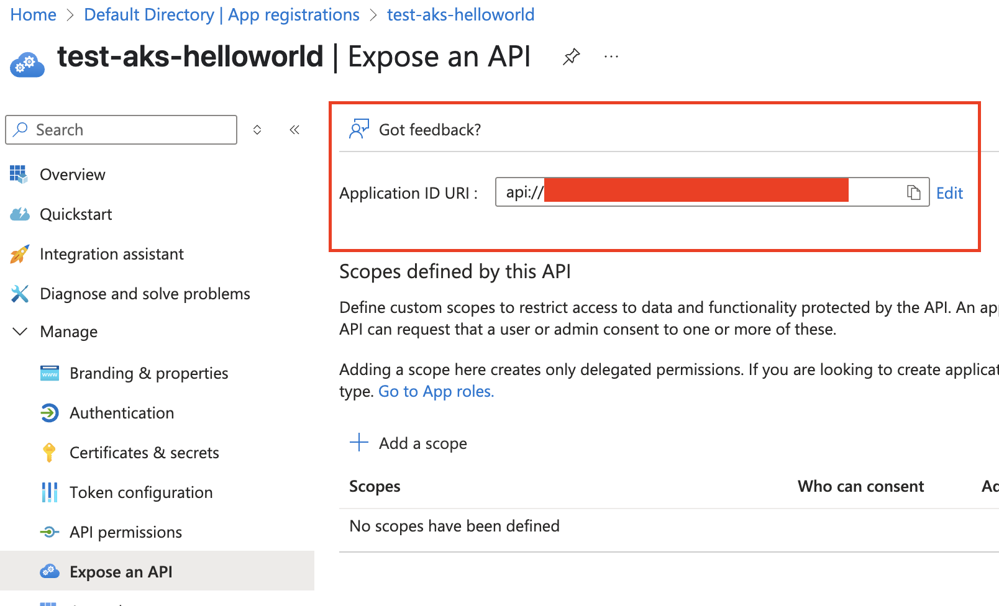
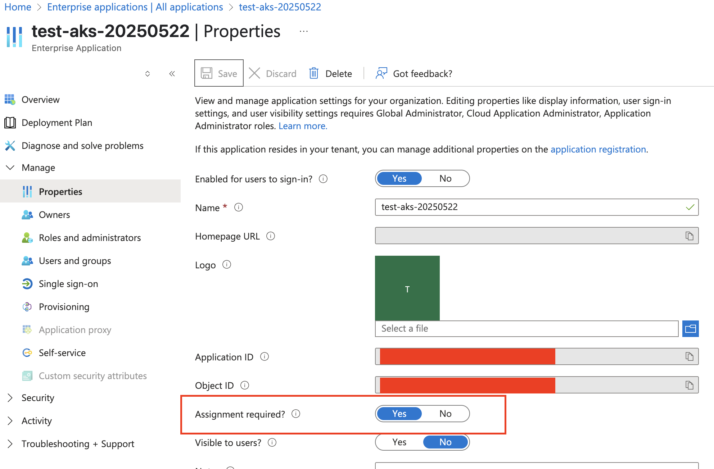

# Managed Identity Using Azure Entra ID Workload Identity (AKS)

This documentation is for instructions on using ambient credentials within Azure Kubernetes Services (AKS). Full documentation on Command Cert Manager Issuer can be found [here](../../README.md).

## Prerequisites

- [kubectl](https://kubernetes.io/docs/reference/kubectl/) installed on your machine and [connected to your AKS cluster](https://learn.microsoft.com/en-us/azure/aks/learn/quick-kubernetes-deploy-cli#connect-to-the-cluster)
- [Helm](https://github.com/helm/helm?tab=readme-ov-file#install) 3.x installed
- [Azure CLI](https://learn.microsoft.com/en-us/cli/azure/install-azure-cli?view=azure-cli-latest) installed and logged in

## Background

There are two types of [managed identities](https://learn.microsoft.com/en-us/entra/identity/managed-identities-azure-resources/overview#managed-identity-types) that your Azure AKS workload may use:
- System-assigned managed identity (MSI)
    - Automatically created and managed by Azure at the cluster level. This identity **can not** be shared with other Azure resources. This is used by default.
- User-assigned managed identity (UAMI)
    - Created and managed by you. Identity **can** be shared with other Azure resources and associated with Kubernetes ServiceAccounts via Azure AD Workload Identity. Requires explicit workload identity configuration (show below).

Since you are using ambient credentials generated by your Azure AKS workload and targeting these credentials for your Command instance, you will need to create an [Azure App Registration](https://learn.microsoft.com/en-us/entra/identity-platform/quickstart-register-app). We will walk through App Registration configuration in this document.

## System-Assigned Managed Identity (MSI)

By default, your AKS cluster is configured to use system-assigned managed identity. Your workload should automatically use the identity assigned to the cluster. You will need to set up the scope of the issuer to reference an app registration. Lastly, you will need to make sure the object ID of the managed identity is associated to a security claim in Keyfactor Command.

1. Install `cert-manager` to your AKS cluster. [Installation steps](https://cert-manager.io/docs/installation/helm/)
1. Install `command-cert-manager-issuer` to your AKS cluster. [Installation steps](../../README.md#installing-command-issuer)
1. Create an Azure App Registration. [Installation steps](#azure-app-registration)
1. Deploy Issuer or ClusterIssuer Resource. [Installation steps](../../README.md#creating-issuer-and-clusterissuer-resources)
    - To use ambient credentials, do not supply a `commandSecretName` to your issuer's specification.
    - **IMPORTANT**: Fill in the `scopes` in your issuer's specification with the Application ID URI of your App Registration, suffixed with `./default`. Example:
        ```yaml
        # Example issuer configuration
        spec:
            scopes: "api://your-app-registration-id/.default"
        ```
1. Add the system-assigned managed identity object ID to a security claim in Keyfactor Command
    ```bash
    export AKS_CLUSTER_RESOURCE_GROUP="" # the resource group your AKS cluster is deployed to
    export AKS_CLUSTER_NAME="" # the name of your AKS cluster
    export CURRENT_TENANT=$(az account show --query tenantId --output tsv)

    echo "AKS Cluster Resource Group: $AKS_CLUSTER_RESOURCE_GROUP"
    echo "AKS Cluster Name: $AKS_CLUSTER_NAME"

    # Get the principal ID of your AKS cluster
    AKS_CLUSTER_OBJECT_ID=$(az aks show --resource-group $AKS_CLUSTER_RESOURCE_GROUP --name $AKS_CLUSTER_NAME --query "identityProfile.kubeletidentity.objectId" -o tsv)
    echo "AKS Cluster MSI Object ID: $AKS_CLUSTER_OBJECT_ID"

    echo "View then OIDC configuration for the Entra OIDC token issuer: https://login.microsoftonline.com/$CURRENT_TENANT/v2.0/.well-known/openid-configuration"
  
    echo "Authority: https://login.microsoftonline.com/$CURRENT_TENANT/v2.0"
    ```

    > **Note**: AKS workloads inherit the kubelet's managed identity, not the cluster's control plane identity. This is why we use `identityProfile.kubeletidentity.objectId` rather than `identity.principalId`.

    You can map the object ID to an OAuth Subject or OAuth Object ID security claim in Keyfactor Command. Make sure the [security claim is associated to a security role](https://software.keyfactor.com/Core-OnPrem/Current/Content/ReferenceGuide/SecurityOverview.htm?Highlight=Security%20Roles) with the required permissions. Please refer to the [Configuring Command](../../README.md#configuring-command) **Configure Command Security Roles and Claims** section for security role requirements.

    Make sure an identity provider is configured in Keyfactor Command with the authority set to the authority output above.

## User-Assigned Managed Identity (UAMI)

User-assigned managed identity configuration is more involved, but allows the identity to be shared across different AKS clusters. The AKS cluster will need to be configured to allow workload identity and the Command Issuer's ServiceAccount will need to reference the client ID of the user-assigned managed identity. You will need to make sure the principal ID of the user-assigned managed identity is associated to a security claim in Keyfactor Command.

1. Install `cert-manager` to your AKS cluster. [Installation steps](https://cert-manager.io/docs/installation/helm/)
1. Enable OIDC and Workload Identity on your AKS cluster. [Learn more](https://learn.microsoft.com/en-us/azure/aks/workload-identity-deploy-cluster)
    ```bash
    export AKS_CLUSTER_RESOURCE_GROUP="" # the resource group your AKS cluster is deployed to
    export AKS_CLUSTER_NAME="" # the name of your AKS cluster

    echo "AKS Cluster Resource Group: $AKS_CLUSTER_RESOURCE_GROUP"
    echo "AKS Cluster Name: $AKS_CLUSTER_NAME"

    echo "Enabling OIDC and workload identity on AKS cluster..."

    az aks update \
        --name ${AKS_CLUSTER_NAME} \
        --resource-group ${AKS_CLUSTER_RESOURCE_GROUP} \
        --enable-oidc-issuer \
        --enable-workload-identity
    ```
1. Create a user-assigned managed identity
    ```bash
    export UAMI_IDENTITY_NAME="command-issuer-uami" # the name you want to give your UAMI

    echo "Creating user assigned managed identity $UAMI_IDENTITY_NAME..."

    az identity create --name "${UAMI_IDENTITY_NAME}" --resource-group "${AKS_CLUSTER_RESOURCE_GROUP}"

    export UAMI_CLIENT_ID=$(az identity show --name $UAMI_IDENTITY_NAME --resource-group $AKS_CLUSTER_RESOURCE_GROUP --query clientId --output tsv)

    echo "Client ID of user-assigned managed identity: $UAMI_CLIENT_ID"
    ```
1. Deploy Command Cert Manager Issuer with ServiceAccount labeled to use workload identity and UAMI client ID

    ```bash
    export UAMI_CLIENT_ID=$(az identity show --name $UAMI_IDENTITY_NAME --resource-group $AKS_CLUSTER_RESOURCE_GROUP --query clientId --output tsv) # should be the same as the previous step

    export ISSUER_NAMESPACE="command-issuer-system"

    echo "Installing command-cert-manager issuer to namespace $ISSUER_NAMESPACE"
    echo "Labeling ServiceAccount to use workload identity with user-assigned-managed-identity client ID $UAMI_CLIENT_ID..."

    helm install command-cert-manager-issuer command-issuer/command-cert-manager-issuer \
        --namespace $ISSUER_NAMESPACE \
        --create-namespace \
        --set "fullnameOverride=command-cert-manager-issuer" \
        --set-string "podLabels.azure\.workload\.identity/use=true" \
        --set-string "serviceAccount.labels.azure\.workload\.identity/use=true" \
        --set-string "serviceAccount.annotations.azure\.workload\.identity/client-id=${UAMI_CLIENT_ID}"    
    ```


    If successful, the Command Issuer Pod will have new environment variables and the Azure WI ServiceAccount token as a projected volume:

    ```shell
    kubectl -n command-issuer-system describe pod
    ```

    ```shell
    Containers:
      command-cert-manager-issuer:
        ...
        Environment:
          AZURE_CLIENT_ID:             <UAMI_CLIENT_ID>
          AZURE_TENANT_ID:             <GUID>
          AZURE_FEDERATED_TOKEN_FILE:  /var/run/secrets/azure/tokens/azure-identity-token
          AZURE_AUTHORITY_HOST:        https://login.microsoftonline.com/
        Mounts:
          /var/run/secrets/azure/tokens from azure-identity-token (ro)
          /var/run/secrets/kubernetes.io/serviceaccount from kube-api-access-6rmzz (ro)
    ...
    Volumes:
      ...
      azure-identity-token:
        Type:                    Projected (a volume that contains injected data from multiple sources)
        TokenExpirationSeconds:  3600
    ```
1. Associate a Federated Identity Credential (FIC) with the User Assigned Managed Identity. The FIC allows Command Issuer to act on behalf of the Managed Identity by telling Azure to expect:
    - The `iss` claim of the ServiceAccount token to match the cluster's OIDC Issuer. Azure will also use the Issuer URL to download the JWT signing certificate.
    - The `sub` claim of the ServiceAccount token to match the ServiceAccount's name and namespace.

    ```shell
    export SERVICE_ACCOUNT_NAME=command-cert-manager-issuer # This is the default Kubernetes ServiceAccount used by the Command Issuer controller.
    export SERVICE_ACCOUNT_NAMESPACE=command-issuer-system # This is the default namespace for Command Issuer used in this doc.

    export SERVICE_ACCOUNT_ISSUER=$(az aks show --resource-group $AKS_CLUSTER_RESOURCE_GROUP --name $AKS_CLUSTER_NAME --query "oidcIssuerProfile.issuerUrl" -o tsv)

    echo "Service account issuer: $SERVICE_ACCOUNT_ISSUER"
    echo "Creating federated credentials for user-assigned managed identity $UAMI_IDENTITY_NAME in resource group $AKS_CLUSTER_RESOURCE_GROUP..."

    az identity federated-credential create \
        --name "${UAMI_IDENTITY_NAME}-federated-credentials" \
        --identity-name "${UAMI_IDENTITY_NAME}" \
        --resource-group "${AKS_CLUSTER_RESOURCE_GROUP}" \
        --issuer "${SERVICE_ACCOUNT_ISSUER}" \
        --subject "system:serviceaccount:${SERVICE_ACCOUNT_NAMESPACE}:${SERVICE_ACCOUNT_NAME}" \
        --audiences "api://AzureADTokenExchange"
    ```

    > Read more about [Workload Identity federation](https://learn.microsoft.com/en-us/entra/workload-id/workload-identity-federation) in the Entra ID documentation.
    >
    > Read more about [the `az identity federated-credential` command](https://learn.microsoft.com/en-us/cli/azure/identity/federated-credential?view=azure-cli-latest).
1. Create an Azure App Registration. [Installation steps](#azure-app-registration)
1. Deploy Issuer or ClusterIssuer Resource. [Installation steps](../../README.md#creating-issuer-and-clusterissuer-resources)
    - To use ambient credentials, do not supply a `commandSecretName` to your issuer's specification.
    - **IMPORTANT**: Fill in the `scopes` in your issuer's specification with the Application ID URI of your App Registration, suffixed with `./default`. Example:
        ```yaml
        # Example issuer configuration
        spec:
            scopes: "api://your-app-registration-id/.default"
        ```
1. Add the user-assigned managed identity principal ID to a security claim in Keyfactor Command
    ```shell
    export UAMI_PRINCIPAL_ID=$(az identity show --name $UAMI_IDENTITY_NAME --resource-group $AKS_CLUSTER_RESOURCE_GROUP --query principalId --output tsv)
    export CURRENT_TENANT=$(az account show --query tenantId --output tsv)
    echo "UAMI Principal ID: ${UAMI_PRINCIPAL_ID}"

    echo "View then OIDC configuration for the Entra OIDC token issuer: https://login.microsoftonline.com/$CURRENT_TENANT/v2.0/.well-known/openid-configuration"
    
    echo "Authority: https://login.microsoftonline.com/$CURRENT_TENANT/v2.0"
    ```

    You can map the principal ID to an OAuth Subject or OAuth Object ID security claim in Keyfactor Command. Make sure the [security claim is associated to a security role](https://software.keyfactor.com/Core-OnPrem/Current/Content/ReferenceGuide/SecurityOverview.htm?Highlight=Security%20Roles) with the required permissions. Please refer to the [Configuring Command](../../README.md#configuring-command) **Configure Command Security Roles and Claims** section for security role requirements.

    Make sure an identity provider is configured in Keyfactor Command with the authority set to the authority output above.


## Azure App Registration

The identity server that generates the access token from DefaultAzureCredentials requires a valid scope. The access token is being used for authorization on a resource outside of Azure (Keyfactor Command), so an app registration for Entra AD to represent an external application.

Here is official Azure documentation on how to [create an app registration](https://learn.microsoft.com/en-us/entra/identity-platform/quickstart-register-app).

After the App Registration is created, expose an API. You can do this by going to Manage > Expose an API and editing the Application ID URI.

> IMPORTANT: The Application ID URI will be used in your `scopes` claim. Make sure to copy this value down. For example, if your Application ID URI is `api://abcd`, your scope value should be `api://abcd/.default`.



### App Registration Assignment Requirement

By default, Azure App Registrations do not require an assignment in order for an identity to access to the application. However, there may be some compliance need to require an assignment for an identity to access your app registration. This option can be toggled via the Enterprise Application properties of your App Registration. If enabled, and your identity does not have an assignment to this application, you may see the error:

```
AADSTS501051: Application '<identity-object-id>'(<identity-name>) is not assigned to a role for the application 'api://<application-id-uri>'(<application-name>)
```



For more information about the assignment requirement for app registrations and how this can affect your identities, please see [this blog post](https://mderriey.com/2019/04/19/aad-apps-user-assignment-required/).